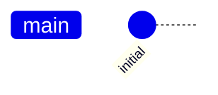
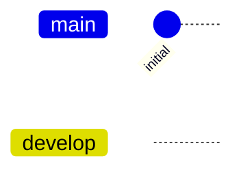
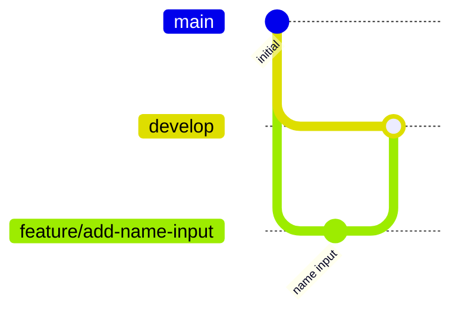
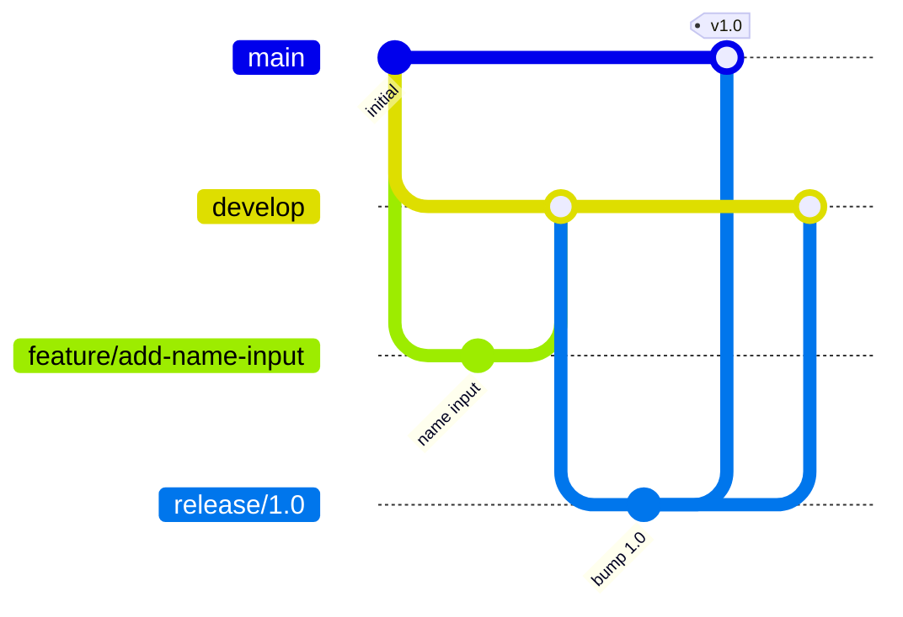
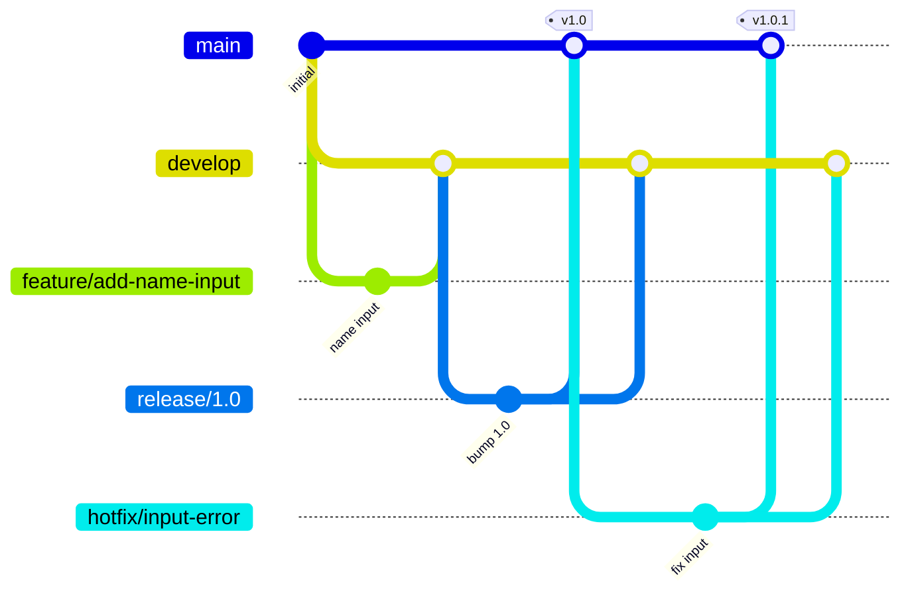

# GitFlow Sample

Step-by-step demonstration of GitFlow workflow with visualizations.

## Installation
```bash
git clone https://github.com/yourusername/gitflow-sample.git
cd gitflow-sample
```

## Steps

### 1. Initial Setup
```bash
mkdir gitflow-sample
cd gitflow-sample
git init
echo "print('Hello World')" > main.py
git add main.py
git commit -m "Initial commit"
```


### 2. Create Develop Branch
```bash
git branch develop
git checkout develop
```


### 3. Feature Branch
```bash
git checkout -b feature/add-name-input
# Update main.py with name input
git add main.py
git commit -m "Add name input feature"
git checkout develop
git merge feature/add-name-input
```


### 4. First Release
```bash
git checkout -b release/1.0
# Update version
git add main.py
git commit -m "Bump version to 1.0"
git checkout main
git merge release/1.0
git tag -a v1.0 -m "Version 1.0"
git checkout develop
git merge release/1.0
```


### 5. Hotfix
```bash
git checkout main
git checkout -b hotfix/input-error
# Fix bug in main.py
git add main.py
git commit -m "Fix input validation"
git checkout main
git merge hotfix/input-error
git tag -a v1.0.1 -m "Version 1.0.1"
git checkout develop
git merge hotfix/input-error
```


## Releases
- v1.0: Initial release with name input feature
- v1.0.1: Hotfix for input validation

## License
MIT License
